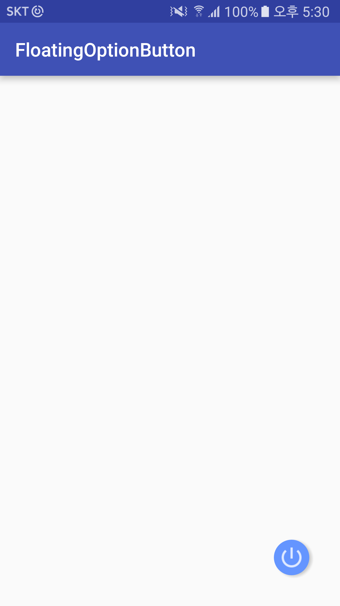
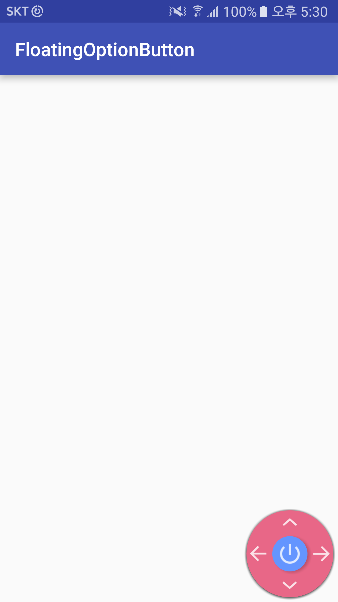

# FloatingOptionButton

Check this sample images

- UI

-How To Code
  - Put options with XML
![XML Layout] (fob3.PNG)
![Code Java] (fob3-1.PNG)

- Put options with Java 
![Layout] (fob4.PNG)
![Java] (fob4-1.PNG)

Contact me => jiwow34@gmail.com
